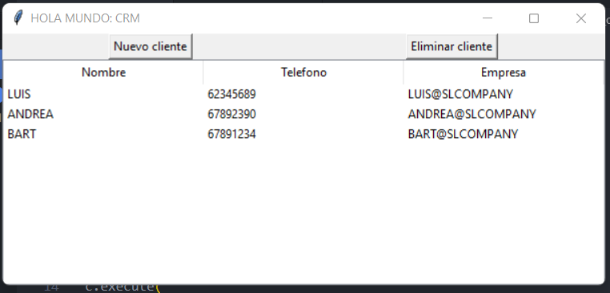
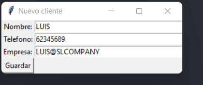

# LIBRETA CLIENTE
Pequeña aplicación de escritorio utilizando la herramienta tkinter de python

CARACTERISTICAS DE LA APLICACION:

* Permite crear, almacenar y borrar clientes
* Usa la biblioteca sqlite3 para crear una base de datos donde se guardarán los clientes

CAPTURAS DE PANTALLA:
* Inicio

* Agregar nuevo cliente

